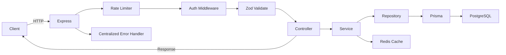
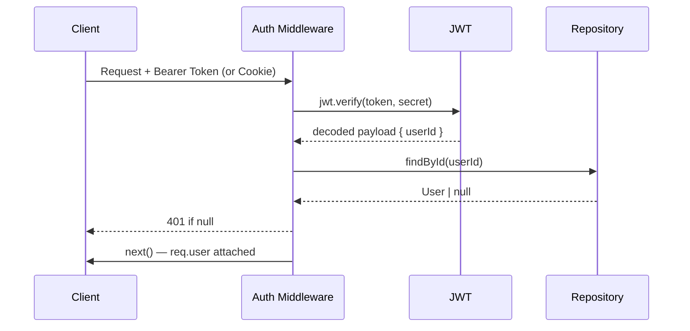
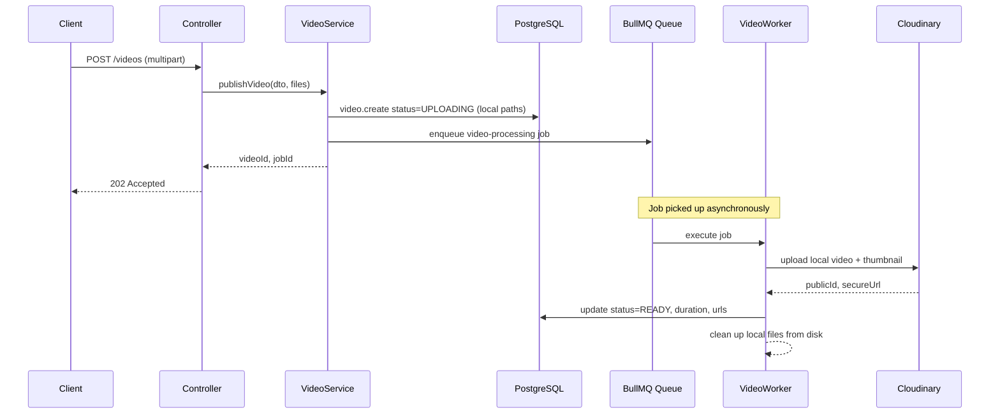
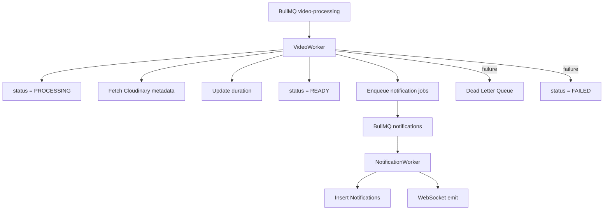
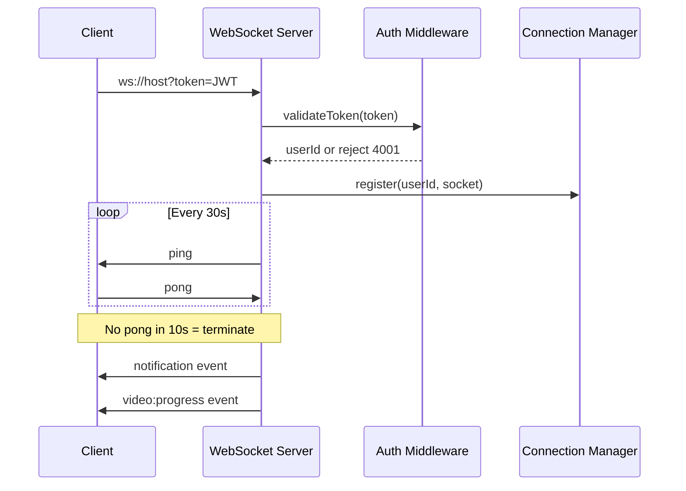
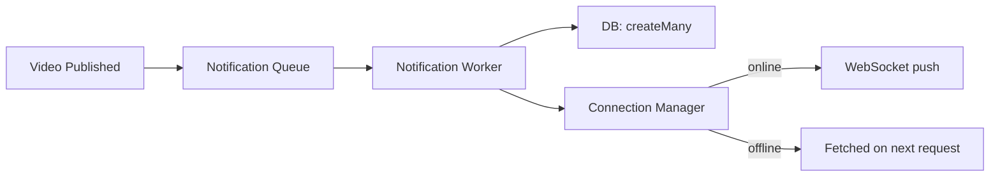
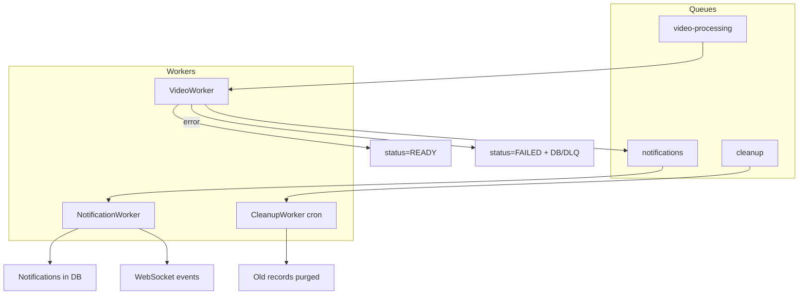

# VideoTube — System Architecture

## Request Flow

```mermaid
flowchart LR
    Client -->|HTTP| Express
    Express --> RateLimit[Rate Limiter]
    RateLimit --> Auth[Auth Middleware]
    Auth --> Validate[Zod Validate]
    Validate --> Controller
    Controller --> Service
    Service --> Repository
    Repository --> Prisma
    Prisma --> PostgreSQL
    Service --> Cache[Redis Cache]
    Controller -->|Response| Client
    Express --> ErrorHandler[Centralized Error Handler]
```

## Authentication Flow

```mermaid
sequenceDiagram
    participant C as Client
    participant A as Auth Middleware
    participant J as JWT
    participant R as Repository
    C->>A: Request + Bearer Token (or Cookie)
    A->>J: jwt.verify(token, secret)
    J-->>A: decoded payload { userId }
    A->>R: findById(userId)
    R-->>A: User | null
    A-->>C: 401 if null
    A->>C: next() — req.user attached
```

## Video Upload Flow

```mermaid
sequenceDiagram
    participant C as Client
    participant Ctrl as Controller
    participant Svc as VideoService
    participant DB as PostgreSQL
    participant Q as BullMQ Queue
    participant W as VideoWorker
    participant CDN as Cloudinary
    C->>Ctrl: POST /videos (multipart)
    Ctrl->>Svc: publishVideo(dto, files)
    Svc->>DB: video.create status=UPLOADING (local paths)
    Svc->>Q: enqueue video-processing job
    Svc-->>Ctrl: videoId, jobId
    Ctrl-->>C: 202 Accepted
    Note over Q,W: Job picked up asynchronously
    Q->>W: execute job
    W->>CDN: upload local video + thumbnail
    CDN-->>W: publicId, secureUrl
    W->>DB: update status=READY, duration, urls
    W-->>W: clean up local files from disk
```

## Worker Flow

```mermaid
flowchart TD
    Q[BullMQ video-processing] --> W[VideoWorker]
    W --> S1[status = PROCESSING]
    W --> S2[Fetch Cloudinary metadata]
    W --> S3[Update duration]
    W --> S4[status = READY]
    W --> S5[Enqueue notification jobs]
    S5 --> NQ[BullMQ notifications]
    NQ --> NW[NotificationWorker]
    NW --> DB[Insert Notifications]
    NW --> WS[WebSocket emit]
    W -->|failure| DLQ[Dead Letter Queue]
    W -->|failure| SE[status = FAILED]
```

## WebSocket Flow

```mermaid
sequenceDiagram
    participant C as Client
    participant WS as WebSocket Server
    participant AM as Auth Middleware
    participant CM as Connection Manager
    C->>WS: ws://host?token=JWT
    WS->>AM: validateToken(token)
    AM-->>WS: userId or reject 4001
    WS->>CM: register(userId, socket)
    loop Every 30s
        WS->>C: ping
        C->>WS: pong
    end
    Note over WS,C: No pong in 10s = terminate
    WS->>C: notification event
    WS->>C: video:progress event
```

## Notification Flow

```mermaid
flowchart LR
    Event[Video Published] --> NQ[Notification Queue]
    NQ --> NW[Notification Worker]
    NW --> DB[DB: createMany]
    NW --> CM[Connection Manager]
    CM -->|online| WS[WebSocket push]
    CM -->|offline| Skip[Fetched on next request]
```

## Queue Flow

```mermaid
flowchart TD
    subgraph Queues
        VQ[video-processing]
        NQ[notifications]
        CQ[cleanup]
    end
    subgraph Workers
        VW[VideoWorker]
        NW[NotificationWorker]
        CW[CleanupWorker cron]
    end
    VQ --> VW --> Ready[status=READY]
    VW -->|error| Failed[status=FAILED + DB/DLQ]
    VW --> NQ
    NQ --> NW --> DB[Notifications in DB]
    NW --> WsEmit[WebSocket events]
    CQ --> CW --> Purge[Old records purged]
```
